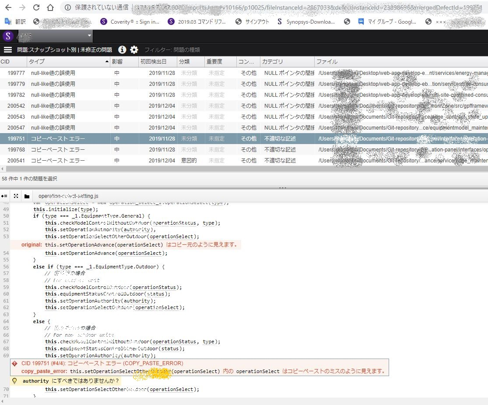
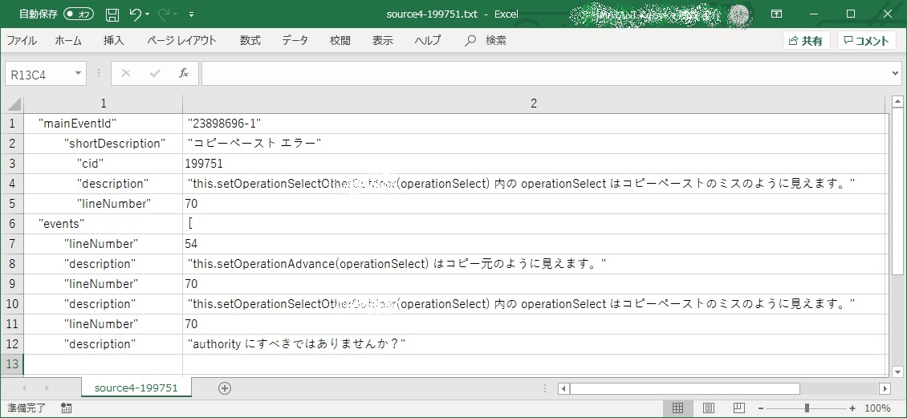
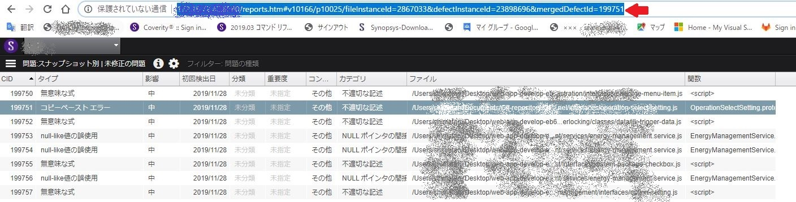
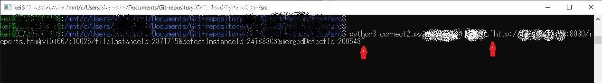
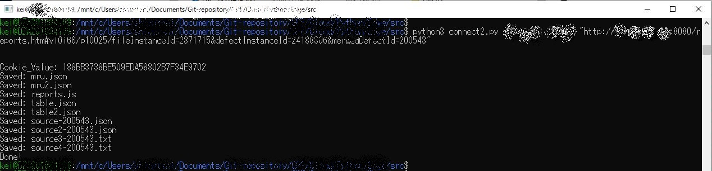

### Coverity Connect から指摘を抽出する方法

- ライセンスを所有する者が指摘を収集する場合に利用します

- `connect2.py` を使って、例えば下図 CID=199751 の指摘をテキストファイルに抽出することができます

#### Coverity Connect 画面



#### 出力結果
- テキスト
```csv
"mainEventId": "23898696-1",
        "shortDescription": "コピーペースト エラー",
            "cid": 199751,
            "description": "this.setOperationSelectOtherxxxxxxxx(operationSelect) 内の operationSelect はコピーペーストのミスのように見えます。",
            "lineNumber": 70
"events": [
        "lineNumber": 54,
        "description": "this.setOperationAdvance(operationSelect) はコピー元のように見えます。",
        "lineNumber": 70,
        "description": "this.setOperationSelectOtherxxxxxxxx(operationSelect) 内の operationSelect はコピーペーストのミスのように見えます。",
        "lineNumber": 70,
        "description": "authority にすべきではありませんか？",
```
- エクセル読み込み
	- 区切り文字に、コンマとコロンを指定します
	

#### 準備・条件

- Coverity ユーザーライセンスが必要です
- Coverity Connect 接続環境
- Python3 実行環境　－　モジュール　sys、requests、json、re、urllib.parse　を使いますので、予めインストールしておいてください
- UTF-8 エンコーディング環境（Shift-JIS ファイルを生成するとエラーが出ますので、Linux環境が望ましいです）

#### 使い方

- Coverity Connect にログインします

- プロジェクトとストリームを選択し、指摘一覧を表示します

- 取得したい指摘を選択します

- 表示されたURLをコピーします

  

- プロジェクトが保存されているフォルダからLinuxシェルを開きます
  
  - エクスプローラーを使い、Shiftを押しながらフォルダを右クリックすると、コンテキストメニューに「Linuxシェルをここに開く」が現れます
  
- Linux シェルが開いたら、 次のコマンドを入力し、引数のURLを　"・・・"  で囲んで実行します

- `$ python3 connect2.py <ユーザーID> <パスワード> "URL"`

- 例

  - `$ python3 connect2.py hoge ?????? "http://xxx.xxx.xxx.xxx:8080/reports.htm#v10166/p10025/fileInstanceId=2871715&defectInstanceId=24188306&mergedDefectId=200543"`

  - 

  - 下図の表示が出て終了します

  - 

  - ファイル "source4-200543.txt" に指摘が出力されます

  - ```txt
        "mainEventId": "24188306-12",
                "shortDescription": "null-like値の誤使用",
                    "cid": 200543,
                    "description": "null のような値 edge_device_data のプロパティにアクセスしています。",
                    "lineNumber": 137
        "events": [
                "lineNumber": 105,
                "description": "分岐条件 !(&quot;items&quot;&nbsp;in&nbsp;edge_item) は、false に分岐しました。",
                "lineNumber": 105,
                "description": "分岐条件 !edge_item[&quot;items&quot;] は、false に分岐しました。",
                "lineNumber": 105,
                "description": "分岐条件 !(&quot;items&quot;&nbsp;in&nbsp;edge_item)&nbsp;||&nbsp;!edge_item[&quot;items&quot;] は、false に分岐しました。",
                "lineNumber": 113,
                "description": "条件 !(&quot;items&quot;&nbsp;in&nbsp;edge_device_item) は true となりました。",
                "lineNumber": 113,
                "description": "条件 !(&quot;items&quot;&nbsp;in&nbsp;edge_device_item)&nbsp;||&nbsp;!edge_device_item[&quot;items&quot;] は true となりました。",
                "lineNumber": 113,
                "description": "代入: edge_device_data = (!(&quot;items&quot;&nbsp;in&nbsp;edge_device_item)&nbsp;||&nbsp;!edge_device_item[&quot;items&quot;])&nbsp;?&nbsp;None&nbsp;:&nbsp;edge_device_item[&quot;items&quot;][0]",
                "lineNumber": 116,
                "description": "分岐条件 edge_device_data は、false に分岐しました。",
                "lineNumber": 119,
                "description": "分岐条件 current_certification_state&nbsp;!=&nbsp;edge_device_model_certification_state は、false に分岐しました。",
                "lineNumber": 129,
                "description": "条件 current_certification_state&nbsp;==&nbsp;1 は true となりました。",
                "lineNumber": 129,
                "description": "条件 new_certification_state&nbsp;==&nbsp;8 は true となりました。",
                "lineNumber": 129,
                "description": "条件 (current_certification_state&nbsp;==&nbsp;1)&nbsp;&amp;&amp;&nbsp;(new_certification_state&nbsp;==&nbsp;8) は true となりました。",
                "lineNumber": 129,
                "description": "分岐条件 !(((current_certification_state&nbsp;==&nbsp;1)&nbsp;&amp;&amp;&nbsp;(new_certification_state&nbsp;==&nbsp;8))&nbsp;||&nbsp;((current_certification_state&nbsp;==&nbsp;8)&nbsp;&amp;&amp;&nbsp;(new_certification_state&nbsp;in&nbsp;{1,&nbsp;9}))) は、false に分岐しました。",
                "lineNumber": 137,
                "description": "null のような値 edge_device_data のプロパティにアクセスしています。",
    
    ```

  - 以上