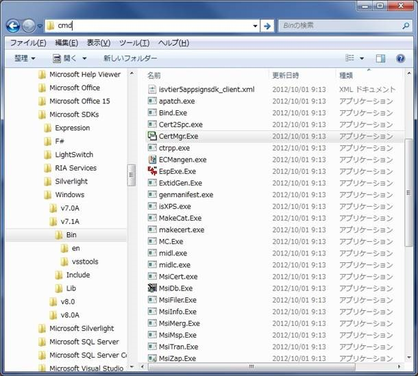
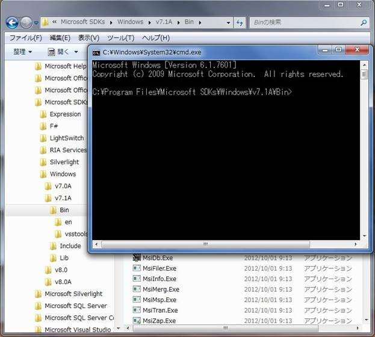

### Coverity
### eBinderのビルドをCoverityで追跡する方法
 - ターゲットフォルダからコマンドプロンプトを開く
   - 例えば、エクスプローラで、"C:\Program Files\Microsoft SDKs\Windows\v7.1A\Bin" を開きます。
   - エクスプローラーのアドレスバーに cmd と入力して Enter
   
   - "C:\Program Files\Microsoft SDKs\Windows\v7.1A\Bin" をカレントにしたコマンドプロンプトが開きます。
   
 - 中間ディレクトリ imd を作成する
   ```
   > mkdir imd
   ```
 - Coverity 実行ファイルにパスを通す
   ```
   > set PATH="C:\Program Files\Coverity\Coverity Static Analysis\bin";%PATH%
   ```
 - cov-configureを一度だけ実行する
   ```
   C:\Users\hoge\Desktop\02.Coverity\path\to\project>cov-build --dir imd "C:\eSOL\eBinder\bin\ebinder.exe"
   
   Coverity Build Capture (32-bit) version 2018.03 on Windows 7 Professional, 32-bit (build 7600)
   Internal version numbers: e1bb2a2a04 p-napa1-push-31731.172
   ```
 - cov-buildを実行する
   ```
   C:\Users\hoge\Desktop\02.Coverity\path\to\project>cov-build --dir imd "C:\eSOL\eBinder\bin\ebinder.exe"
   
   Coverity Build Capture (32-bit) version 2018.03 on Windows 7 Professional, 32-bit (build 7600)
   Internal version numbers: e1bb2a2a04 p-napa1-push-31731.172
   ```
 - cov-analyzeを実行する
    ```
    C:\Users\hoge\Desktop\02.Coverity\path\to\project>cov-analyze --dir imd --all
    Using 1 worker as limited by CPU(s), memory
    Looking for translation units
    |0----------25-----------50----------75---------100|
    ****************************************************
    [STATUS] Computing links for 1778 translation units
    |0----------25-----------50----------75---------100|
    ****************************************************
    [STATUS] Computing virtual overrides
    |0----------25-----------50----------75---------100|
    ****************************************************
    [STATUS] Computing callgraph
    |0----------25-----------50----------75---------100|
    ****************************************************
    [STATUS] Topologically sorting 43206 functions
    |0----------25-----------50----------75---------100|
    ****************************************************
    [STATUS] Computing node costs
    |0----------25-----------50----------75---------100|
    ****************************************************
    [STATUS] Running analysis
    |0----------25-----------50----------75---------100|
    ****************************************************
    [STATUS] Exporting summaries
    |0----------25-----------50----------75---------100|
    ****************************************************
    Analysis summary report:
    ------------------------
    Files analyzed                 : 2710
    Total LoC input to cov-analyze : 875366
    Functions analyzed             : 25058
    Classes/structs analyzed       : 2415
    Paths analyzed                 : 1614425
    Time taken by analysis         : 00:50:38
    Defect occurrences found       : 2306 Total
                                        1 ALLOC_FREE_MISMATCH
                                      10 ARRAY_VS_SINGLETON
                                        2 ATOMICITY
                                        1 BAD_COMPARE
                                        2 BAD_FREE
                                        1 BAD_OVERRIDE
                                      17 BAD_SHIFT
                                        2 BAD_SIZEOF
                                        6 BUFFER_SIZE
                                      33 BUFFER_SIZE_WARNING
                                      122 CHECKED_RETURN
                                        7 CONSTANT_EXPRESSION_RESULT
                                        5 COPY_PASTE_ERROR
                                        3 CTOR_DTOR_LEAK
                                        1 DC.WEAK_CRYPTO
                                      83 DEADCODE
                                      12 DELETE_VOID
                                        1 EVALUATION_ORDER
                                      651 FORWARD_NULL
                                        1 INFINITE_LOOP
                                        2 INTEGER_OVERFLOW
                                      55 MISSING_BREAK
                                      22 MISSING_LOCK
                                        2 MISSING_RESTORE
                                        2 MISSING_RETURN
                                      29 MIXED_ENUMS
                                      44 NEGATIVE_RETURNS
                                        1 NESTING_INDENT_MISMATCH
                                      15 NO_EFFECT
                                      24 NULL_RETURNS
                                        1 ORDER_REVERSAL
                                      144 OVERRUN
                                      10 PW.ASSIGN_WHERE_COMPARE_MEANT
                                        2 PW.BAD_MACRO_REDEF
                                      12 PW.INCLUDE_RECURSION
                                        1 PW.MISSING_TYPEDEF_NAME
                                        1 PW.MISSING_TYPE_SPECIFIER
                                      48 PW.PARAMETER_HIDDEN
                                        4 PW.PARAM_SET_BUT_NOT_USED
                                        7 PW.QUALIFIER_IN_MEMBER_DECLARATION
                                        1 PW.USELESS_TYPE_QUALIFIER_ON_RETURN_TYPE
                                      69 RESOURCE_LEAK
                                        8 REVERSE_INULL
                                        1 REVERSE_NEGATIVE
                                      67 RW.FUNCTION_DOES_NOT_MATCH_ARGUMENTS
                                      236 RW.NO_MATCHING_NEW_FUNCTION
                                      256 RW.ROUTINE_NOT_EMITTED
                                        5 SIZEOF_MISMATCH
                                        1 STRAY_SEMICOLON
                                      19 STRING_OVERFLOW
                                        3 TAINTED_SCALAR
                                      75 UNINIT
                                      144 UNINIT_CTOR
                                      10 UNREACHABLE
                                      21 UNUSED_VALUE
                                        3 VARARGS
    ```
 - cov-commit-defectsを実行する
    ```
    C:\Users\hoge\Desktop\02.Coverity\path\to\project>cov-commit-defects --dir imd --host xxx.xxx.xxx.xxx --port 8080 --stream project --user hoge
    Coverity Defect Commit Client version 2018.03 on Windows 7 Professional, 32-bit
    (build 7600)
    Internal version numbers: e1bb2a2a04 p-napa1-push-31731.172

    Enter passphrase for user 'hoge':

    Getting data port from http://xxx.xxx.xxx.xxx:8080/start-listener.cgi
    Connecting to server xxx.xxx.xxx.xxx:9090
    Upgrading encryption to "required" because we have a certificate
    from a past session for this server.
    Connection is encrypted.
    [STATUS] 2019-11-15 03:40:58 UTC - Committing 56 defect files...
    |0----------25-----------50----------75---------100|
    ****************************************************
    [STATUS] 2019-11-15 03:41:03 UTC - Committing 3285 file descriptions...
    |0----------25-----------50----------75---------100|
    ****************************************************
    [STATUS] 2019-11-15 03:41:12 UTC - Committing 3283 source files...
    |0----------25-----------50----------75---------100|
    ****************************************************
    [STATUS] 2019-11-15 03:40:59 UTC - Calculating 3285 cross-reference bundles...
    |0----------25-----------50----------75---------100|
    ****************************************************
    [STATUS] 2019-11-15 03:41:39 UTC - Committing 3285 cross-reference bundles...
    |0----------25-----------50----------75---------100|
    ****************************************************
    [STATUS] 2019-11-15 03:41:52 UTC - Committing 25058 functions...
    |0----------25-----------50----------75---------100|
    ****************************************************
    [STATUS] 2019-11-15 03:42:05 UTC - Committing 56 defect files...
    |0----------25-----------50----------75---------100|
    ****************************************************
    [STATUS] 2019-11-15 03:42:13 UTC - Committing 4 output files...
    |0----------25-----------50----------75---------100|
    ****************************************************
    [STATUS] 2019-11-15 03:42:13 UTC - Sending hashes for 4095 summaries...
    |0----------25-----------50----------75---------100|
    ****************************************************
    [STATUS] 2019-11-15 03:42:16 UTC - Committing 4087 summaries...
    |0----------25-----------50----------75---------100|
    ****************************************************
    New snapshot ID 11453 added.
    Elapsed time: 00:01:26
    ```
